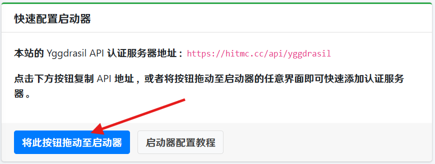
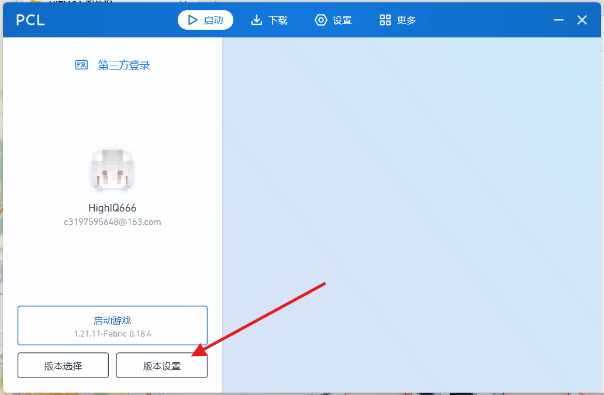
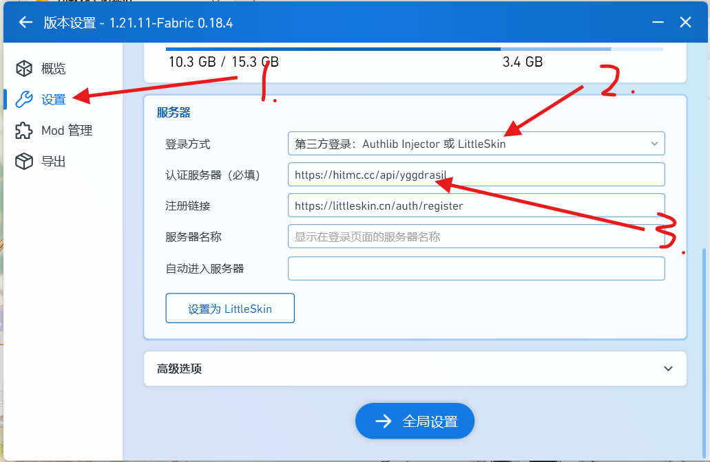
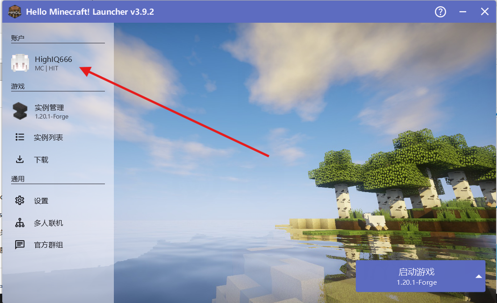
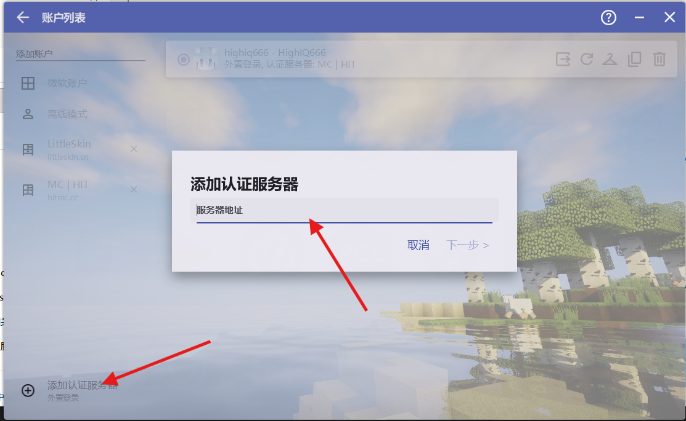

# HITMC 入服指南

inclyc    HighIQ666

2026年1月20日

## 1 引言

欢迎加入 HITMC 大家庭！
我们的成员来自全国各地，包括本部、深圳、威海、哈尔滨工程大学以及其他各大高校的 Minecraft 玩家。
我们的服务器自 2022 年 3 月起运行，从最初的纯净生存模式，已经发展成为一个包含多个服务器的平台，定期举办各种丰富多彩的活动。
在这里，你可以体验到无尽的乐趣和挑战。

## 2 如何加入服务器

我们的服务器采取统一身份认证：

[https://hitmc.cc](https://hitmc.cc)

需要在此网站注册一个用户，一个用户可以拥有多个游戏角色。
所有的服务器统一采取此认证，不设白名单，注册一次账号之后就不需要重新注册。

### 2.1 索取邀请码

服务器采取邀请制。因此你需要向一位管理索取邀请码。
一般选择年级较低的管理，高年级管理大多已毕业，忙于工作等事情。
最好主动提供**年级 + 学校**，便于我们进行管理。

### 2.2 创建角色，编辑皮肤

创建一个用于加入游戏的角色，你可以上传任意皮肤，以及披风，并为 ta 起一个名字。

**注意：不要使用中文名称，否则可能会出现问题。**

### 2.3 编辑启动器端认证

此方法适用于市面上常见的启动器，如`pcl2`,`hmcl`等。

#### 第一种方法

将此按钮拖动至启动器即可。

#### 第二种方法

##### pcl2

**注册链接空着不用写**

##### hmcl

按次序编辑内容即可。
配置完成后，输入你在`hitmc.cc`中注册的账号密码，即可完成启动器端认证登录配置。

### 2.4 导入整合包（如果有需要）

服务器资源文件位于**群文件->当前周目资源**，将所需的 zip 文件下载完毕后，拖拽到启动器上即可开始自动下载。

**注意：整合包有可能出现 zip 嵌套的情况，请确保拖入的是整合包，而不是打包了整合包的 zip 文件。**

## 3 结语

我们欢迎各路玩家在服务器中留下各自的作品，或者为我们的 mod 服提供新的意见与建议。  
希望大家在服务器玩的开心，共建一个美好的 HITMC 大家庭。
