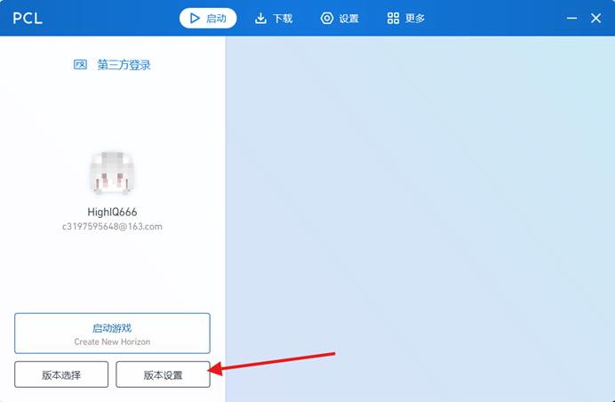
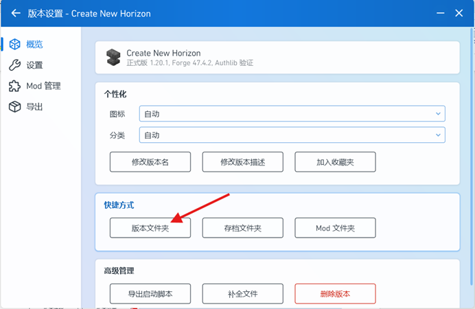
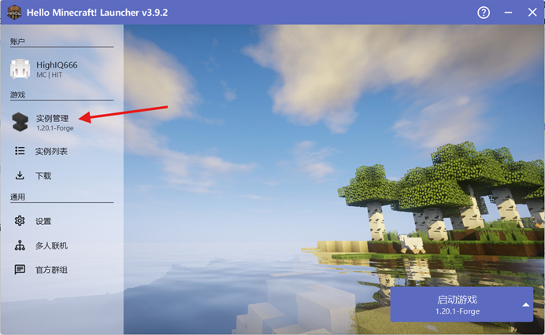
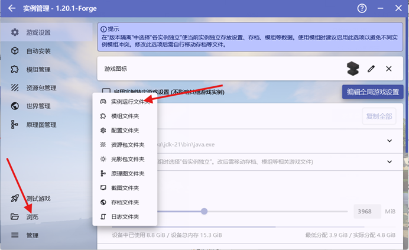
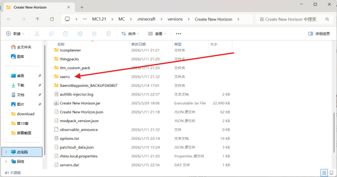
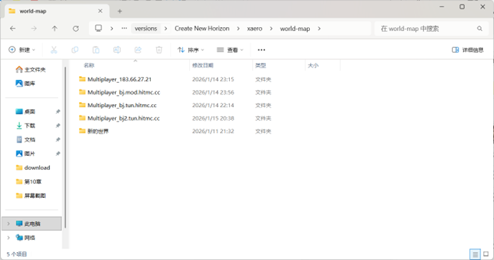

# HITMC客户端服务器地图迁移指南
HighIQ666

由于隧道带宽上限、连接不稳定、处于本部校内或校外等原因，可能存在需要切换隧道以正常连接服务器的情况。其中，2026寒假周目 CTNH 服务器就是典型例子，因隧道带宽上限，需通过其他路线进入服务器。若客户端安装了如 xaero 地图等地图 mod，可能会出现数据不同步等问题，以下提供详细解决指导。

## 操作步骤总览
1. 找到游戏根目录
2. 找到客户端地图文件存放根目录
3. 复制并替换对应文件

## 详细操作指南
### 1. 如何找到游戏根目录
以下以 PCL 和 HMCL 启动器为例，其他启动器操作逻辑类似，找到对应功能按钮即可，也可直接通过资源管理器查找。

#### PCL 启动器

点击对应按钮即可打开游戏根目录。

#### HMCL 启动器

点击对应按钮即可打开根目录。

### 2. 找到地图根目录
以下以 xaero 地图为例，其他地图 mod 可查询对应百科找到存放目录。

打开后，若同时安装了 xaero 的小地图与世界地图，会出现两个文件夹：`minimap`（小地图）和 `world-map`（世界地图），两者操作原理一致，均需进行复制替换。

以 `world-map` 文件夹为例：

- 带有 `multiplayer` 前缀的文件夹为多人服务器的地图数据
- 不带 `multiplayer` 前缀的文件夹为单人游戏数据
- 文件夹名称后附的地址对应具体服务器，需明确自身所需切换的服务器地址（如图中均为 HITMC 周目 mod 服地址）

### 3. 复制并替换
此步骤操作简单，具体流程如下：
1. 确定需要保留的服务器地图数据（如 `bj.mod.hitmc.cc` 地址对应的文件夹）
2. 删除需要替换的服务器地图文件夹下的所有内容（如 `bj.tun.hitmc.cc` 文件夹）
3. 将保留的服务器地图文件夹（`bj.mod.hitmc.cc`）下的所有内容复制到已清空的目标文件夹（`bj.tun.hitmc.cc`）中，完成替换